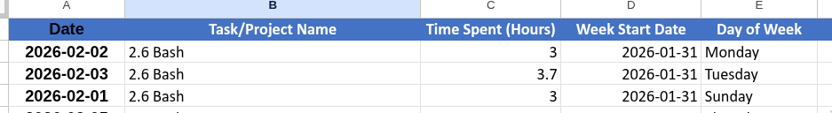

# Time Tracking Automation 

**An automated ETL pipeline to sync local productivity data with Google Sheets.**

## Project Overview
This project automates the process of logging study hours to maintain consistency in my DevOps learning journey. Instead of manual entry, this system extracts data from the [Super Productivity app](https://github.com/super-productivity/super-productivity), transforms it using Linux command-line tools, and synchronizes it with a Google Spreadsheet via a custom Apps Script API.

**Final Result in Google Sheets:**


## Tech Stack
* **Scripting:** Bash (Shell Scripting)
* **Data Parsing:** `jq` (JSON processor), `sed`
* **Calculation:** `bc` (Arbitrary precision calculator)
* **Network:** `curl`
* **Automation:** Cron (Linux Task Scheduler)
* **Backend:** Google Apps Script (Web App)

## Architecture & Workflow
1.  **Extraction:** The script reads raw JSON data from `sync-data.json` provided by the productivity app.
2.  **Transformation:**
    * Strips application-specific prefixes using `sed`.
    * Parses tasks and durations (ms) using `jq`.
    * Converts milliseconds to hours using `bc` for precision.
3.  **Synchronization:**
    * `check.sh` verifies `last_success.log` to determine if a sync is needed.
    * `tracker.sh` sends the formatted data to the Google Sheets API via `curl`.


## Cloud Backend (Google Apps Script)
To bridge the local terminal with Google Sheets, we use a Google Apps Script deployed as a Web App. This acts as a lightweight API receiver.

### Backend Code
Paste this into your Google Apps Script editor (Extensions > Apps Script):

```javascript
function doGet(e) {
  // 1. Get the data from the URL variables
  var date = e.parameter.date;
  var task = e.parameter.task;
  var hours = e.parameter.hours;
  var week_start_date = e.parameter.week_start;
  var day_of_the_week = e.parameter.day_of_the_week;
  
  // 2. Access the spreadsheet
  var ss = SpreadsheetApp.getActiveSpreadsheet();
  var sheet = ss.getSheetByName("Raw Data"); // Spreadsheet tab must be named "Raw Data"
  
  // 3. Add the data to the next available row
  sheet.appendRow([date, task, hours, week_start_date, day_of_the_week]);
  
  // 4. Send confirmation back to terminal
  return ContentService.createTextOutput("Success: Row added to Spreadsheet!");
}
# Deployment Configuration

When deploying, ensure the access is set to **"Anyone"** to allow the curl request to execute successfully.

---

# 🚀 Getting Started

## Prerequisites

Ensure you have the following tools installed on your Linux system:

- Bash

Install required packages:

```bash
sudo apt install jq bc curl
```

## Installation

Clone the repository:

```bash
git clone https://github.com/AnisEmad/time_tracking_automation.git
cd time_tracking_automation
```

## Configuration

Create a `.env` file from the example:

```bash
cp .env.example .env
```

Add your Google Apps Script Web App URL to the `.env` file.

## Set up Automation

Add the following to your `crontab -e` to handle missed syncs automatically on system boot:

```bash
@reboot /path/to/your/folder/check.sh
```

## Verification

Upon a successful run, your terminal will confirm the data upload as follows:

```bash
Success: Row added to Spreadsheet!
```